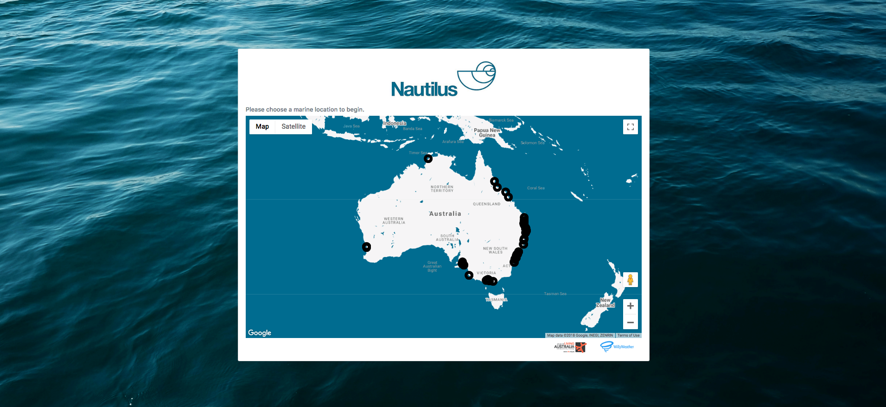
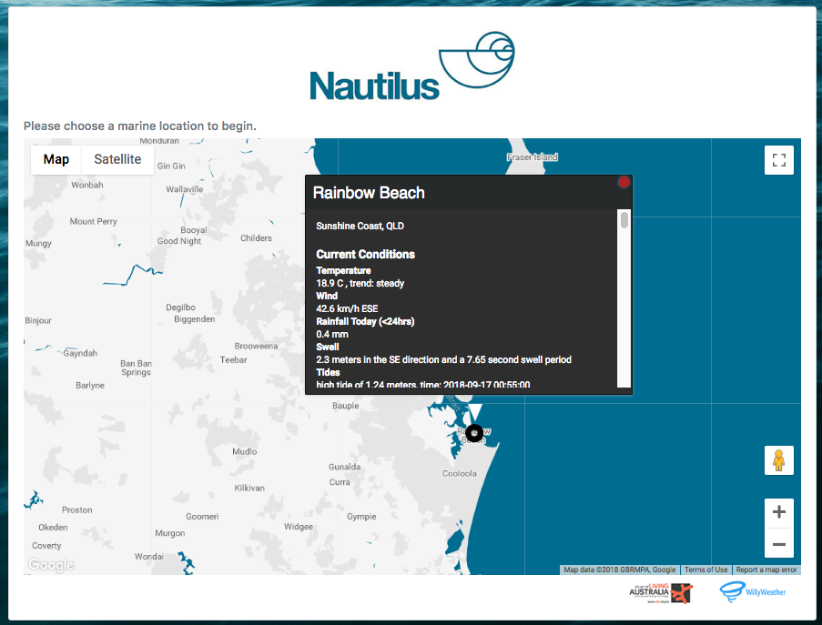
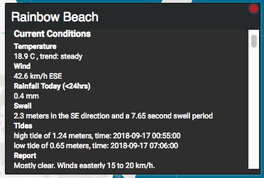
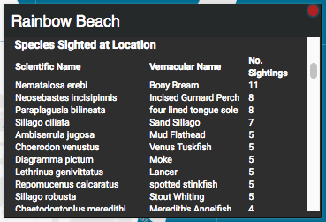

# Nautilus
API Mash-Up and Docker Deployment Project

Nautilus is a service that helps seagoers of all kinds learn about marine weather conditions and wildlife in coastal areas of Australia. Nautilus uses information made available by Willy Weather and the Atlas of Living Australia (ALA) and presents it in an interactive visual map using the Google platform to provide a seamless and intuitive user experience for surfers, divers, fishermen/women, and tourists.

Using Nautilus involves browsing markers that indicate a number of beach locations across Australia and clicking them to be shown an information window containing information that is useful in learning about or informing ones decision on visiting a specific coastal location. The information users are presented with include current weather observations and forecasts for the day with metrics such as temperature, wind, swell, and tides and marine species observations results that have been collected in close proximity in a table of species and sighting counts. The combination of these two areas of information provides a unique insight into potential dangers and opportunities that are important to consider on the biologically diverse and sometimes harsh environment that is the Australian coastline.

### Google Maps Platform – The Maps JavaScript API
The Maps JavaScript API is part of the Google Maps platform that allows developers to customise maps and create content to be displayed within them. This allows for a map to be embedded in a HTML page and manipulated using JavaScript to change topography styling and default locations and zoom. In the case of Nautilus, the embedded map is the central point of interaction for the application. Markers and associated information were created using the API specification that makes up the user experience.

### Willy Weather – Weather API
The Willy Weather API provides developers with access to weather forecasts, observations and warnings for thousands of locations all around Australia. Forecasts and observations include a large number of metrics to describe weather conditions, in the case of Nautilus, those that relate specifically to marine conditions were of interest; such as swell, tidal movements, wind, and temperature. This information can be used to give an indication of whether the conditions are favourable for different activities (fishing, surfing, diving). The API authentication is done over HTTPS to return a JSON response. Each request is authenticated using a private key contained within the URL. The weather data consists of many parts that can all be requested simultaneously, requested by location id. This process is employed by Nautilus to ask for relevant data when a user selects a map marker.

### Atlas of Living Australia – Web Service API
The Atlas of Living Australia is a collaborative, national project that aggregates biodiversity data from multiple sources and makes it freely available and usable online. The ALA API provides access to data for observations, species lists, and associated locations for animals that have been sighted in Australia in all types of habitats. Marine wildlife in Australia is extremely diverse and knowing where they can be observed is of particular interest to fishing/diving enthusiasts and tourists. The marine species that have been observed in an area can indicate to users if that location is a good place to catch fish for seafood, or spectate in their habitat, it can also indicate whether a particular location may be dangerous, and that special caution or equipment is required. The API authentication is done over HTTPS to return a JSON response. Nautilus looks at marine species observations in a 10km radius of a given coastal location when a map marker is clicked and presents the response data in a table to inform users.

## Usage
Nautilus is a service that helps seagoers of all kinds learn about marine weather conditions and wildlife in coastal areas of Australia. Nautilus uses information made available by Willy Weather and the Atlas of Living Australia (ALA) and presents it in an interactive visual map using the Google platform to provide a seamless and intuitive user experience for surfers, divers, fishermen/women, and tourists.

Using Nautilus is simple, just select a circular marker on the map to bring up current marine weather and wildlife information in a pop-up information window. If you wish, you can open multiple windows at the same time or close them by clicking the red button in the top left side of the window card.

Here's the landing page

  

When you select a marker an information window will open like this one

  

Now you can get the information you want about this location by scrolling down

  

  

Use this information to stay safe and enjoy our unique coastal environment whatever your activity of choice may be!

## Technical
Nautilus is a web application that operates using the JavaScript runtime Node.js and the Express web application framework. The application consists of several JavaScript files that are which manage requests and create content for the user using the webpack module bundler. This allowed for easier separation of server and client processing and managing public resources. The front-end of Nautilus was created using the Bootstrap 4 framework for HTML and CSS based design. 

  

### Client Side
When accessing Nautilus, the client starts a request to the server which initiates the rendering of the landing page (index.html). The user is presented with a single page website that contains a single large Bootstrap container and a script is called to create a map using the Google Maps API. The map and its content are created with the a ‘build’ script file which is compiled as specified in a webpack configuration file that was made. The JavaScript operations are run in the ‘src’ folder and define the styling of the map and also creates the markers and associated empty infowindows with click events from a pre-existing JSON of beach locations around Australia. 
When a user selects a marker the click event initiates a function to collect the data required to populate the infowindow on the map. This function performs two jQuery AJAX POST operations sending the location data (location ID, latitude, longtitude) and receives two JSON responses which is formatted to a HTML string so that it the infowindow content can be updated. 

### Server Side
The server-side operations in Nautilus manage routing and API requests to Willy Weather and ALA. Using the Express framework for requests, the server side responds the AJAX POST requests by running two functions containing Node.js requests using the location data. Some middleware to transfer the data was used with body-parser which sends the JSON to be filtered.

### Deployment
Nautilus has been deployed via a Docker container, sitting on top of a Linux VM (Virtual Machine). In order to achieve this a Docker image was created to wrap up the application and its dependencies as specified by a Dockerfile configuration.
